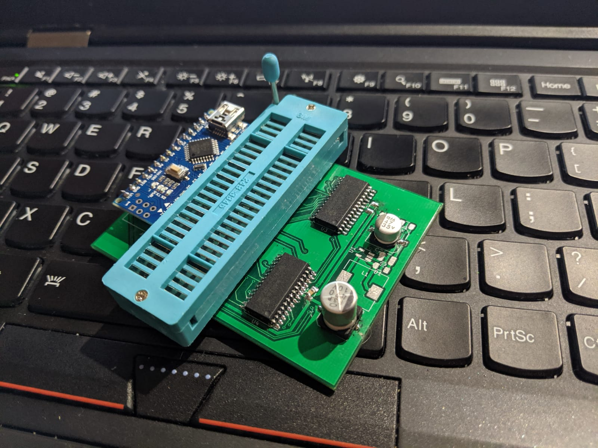
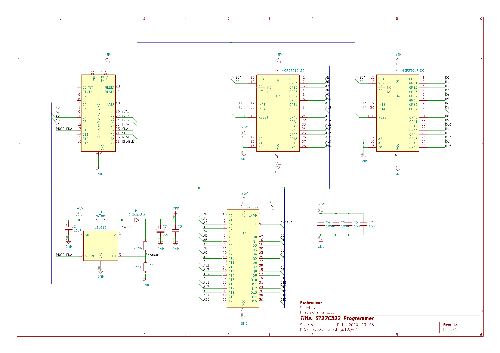

# ST27C322 EPROM Programmer


  
This schematic is for an EPROM programmer that I put together to allow me to build a switchable Amiga Kickstart.  The plan is to put DiagROM and Kickstarts v1.3, v2.4, and v3.1.1 on a single EPROM. It uses a boost converter to generate the programming voltage _VPP_ so it can be run from USB only. It uses [MCP23017](./docs/MCP23017-datasheet.pdf) IO extenders to generate enough Address and Data lines. The Data lines are driven by the io extender at ```0x20``` while the high data lines are driven by the io extender at ```0x24```.

The current state of this board is alpha. The drill holes for the socket are too small and there are things that need to be properly tested.

The intention with the firmware is to make it handle intel hex via terminal with an ```PASSED``` or:

>
> ERR @ b###########: 0x#### != 0x####
>


# Pinout 

| Arduino | Connected |
|-|-|
| D5 | Address 0 |
| D6 | Address 1 |
| D7 | Address 2 |
| D8 | Address 3 |
| D9 | Address 4 |
| D10 | Programmer Enable - turns on boost converter |
| A0 | INTB on Address io extender |
| A1 | INTA on Address io extender |
| A2 | INTB on Data io extender |
| A3 | INTA on Data io extender |
| A4 | SDA of I2C bus |
| A5 | SDC of I2C bus |
| A6 | RESET of io extender |
| A7 | ENABLE for EEPROM |

# Schematic 

The following schematic was made with KiCAD 5.1.5.  It is currently inadequtely tested.


